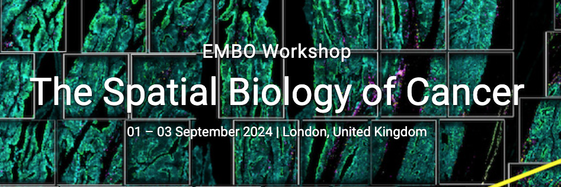

# EMBO_hackathon
Codes for EMBO Hackathon "The Spatial Biology of Cancer"

On the first day of the workshop, we will run a Hackathon that will allow you to get familiar with the analysis of various type of spatial data as well as will be a nice icebreaker to know other participants. 

The Hackathon is divided into two levels and detailed information will be given on the day. Please bring your own laptop because no computers will be provided on site. The Hackathon is based on R programming language. Required packages will be provided in the 00_depencencies.html file. Please note that all packages must be already up and running on your machine before the Hackathon starts. 

To aid the formation of groups, at the registration desk you will be asked to choose a coloured dot sticker that best represents your background:
- Green = biologist
- Yellow = bioinformatician
- Blue = quantitative scientist (mathematician; physicist; statistician; etc) 
- Red = clinical scientist

Place your sticker on the conference badge and find other 8 or 9 people (each group will be formed of 9 or 10 people) with diverse background. The more diverse and colour-balanced the group is, the better.
For virtual participants.
We will assign you in virtual rooms. Details will be given in due course

# Contributors

- *Main Developers* : Mariachiara Grieco, Pietro Antei
- *Developers*: Federica Schieppati, Alessia Avon
- *Supervisors*: Matteo Cereda, Maria Secrier, and Francesca Ciccarelli
